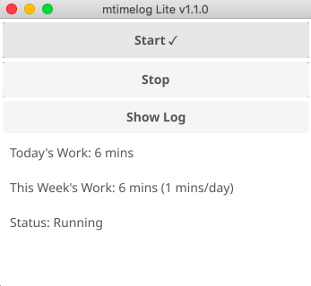

# mtimelog

<!-- PROJECT LOGO -->
<p align="center">
  <a href="#">
    
  </a>

  <h3 align="center">mtimelog</h3>

  <p align="center">
    Minimalist time tracking tool for daily and weekly work logging.
    <br />
    <br />
    <a href="https://github.com/mrauer/mtimelog/issues">Report Bug</a>
    |
    <a href="https://github.com/mrauer/mtimelog/issues">Request Feature</a>
  </p>
</p>

## Table of Contents

* [About the Project](#about-the-project)
* [Installation](#installation)
  * [Linux](#linux)
  * [Mac](#mac)
  * [Windows](#windows)
* [Usage](#usage)
* [Contribute](#contribute)

## About the Project

**mtimelog** is a desktop time tracking tool designed for simplicity and effectiveness. With a clean interface, it's ideal for quickly logging your work sessions and viewing daily or weekly summaries. Inspired by [gtimelog](https://gtimelog.org/), but built from scratch in Go using the Fyne GUI toolkit.

Key features:

- Simple "Start" and "Stop" workflow  
- Automatic logging to a local file  
- Daily and weekly time summaries  
- Cross-platform support (Linux, Mac, Windows)  
- “Show Log” button to view raw log entries

<br><br>

<div align="center">
  
</div>

<br><br>

## Installation

You can find binaries for Linux, Mac, and Windows on the [Releases Page](https://github.com/mrauer/mtimelog/releases).

### Linux

Install required dependencies:

```bash
sudo apt-get update
sudo apt-get install libxcursor-dev libxrandr-dev libxinerama-dev libxi-dev libgl1-mesa-dev xorg-dev
```

Then download and install the binary:

```bash
curl -Lo mtimelog https://github.com/mrauer/mtimelog/releases/download/v0.1.0/mtimelog_linux_amd64 \
&& chmod +x mtimelog \
&& sudo mv mtimelog /usr/local/bin
```

### Mac

```bash
curl -Lo mtimelog https://github.com/mrauer/mtimelog/releases/download/v0.1.0/mtimelog_darwin_amd64 \
&& chmod +x mtimelog \
&& sudo mv mtimelog /usr/local/bin
```

### Windows

Download the latest `.exe` from the [releases](https://github.com/mrauer/mtimelog/releases), and run it directly.

## Usage

When launched, you'll see three main buttons:

- **Start**: Begin a work session (logs a "START" entry)  
- **Stop**: End a work session (logs a "STOP" entry)  
- **Show Log**: Opens the raw log file using your system's default text editor  

Below the buttons, you'll see:

- Today's total work time  
- Weekly summary (total and per weekday average)  
- Current status ("Running" or "Stopped")  

All entries are saved in a simple text file named `work_log.txt` in the same directory.

Example log entry:

```
2025-04-20 09:12:01 START  
2025-04-20 12:34:10 STOP
```

## Contribute

Suggestions, bug reports, and pull requests are welcome! Head over to the [issues](https://github.com/mrauer/mtimelog/issues) tab to start a discussion or propose a change.

To build the project locally:

```bash
sudo apt-get install libxcursor-dev libxrandr-dev libxinerama-dev libxi-dev libgl1-mesa-dev xorg-dev
go mod tidy
go build -o mtimelog main.go
```

You’ll need Go installed and Fyne libraries configured.
